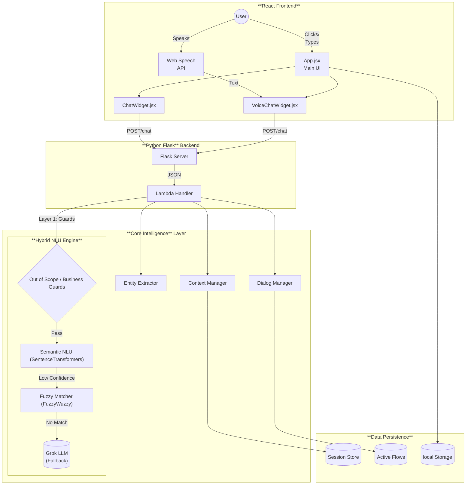

# Application Architecture

## System Overview

The B2B Chat Application follows a modern client-server architecture with a **Hybrid NLU** engine.

## Component Details

### 1. Frontend (React)
-   **App.jsx**: Manages global state (Theme, Voice Settings, Navigation).
-   **VoiceChatWidget**: Handles Microphone input, STT (Speech-to-Text), and TTS (Text-to-Speech) using the browser's **Web Speech API**.
-   **State Sync**: Voice settings are lifted up to `App.jsx` to ensure consistency.

### 2. Backend (Flask + Python)
-   **Lambda Handler**: Central orchestration logic.
-   **Hybrid NLU**:
    -   **Semantic Search**: Uses BERT embeddings (`sentence-transformers`) to understand intent meaning (e.g., "How much is it?" = Pricing).
    -   **Fuzzy Matching**: Fallback for specific keywords or typos.
    -   **Grok LLM**: Final fallback for complex queries or chit-chat that the NLU cannot handle.
-   **Context Manager**: Tracks conversation history and resolves references like "it" or "that".
